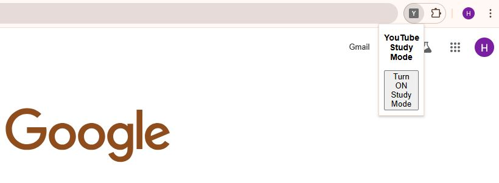
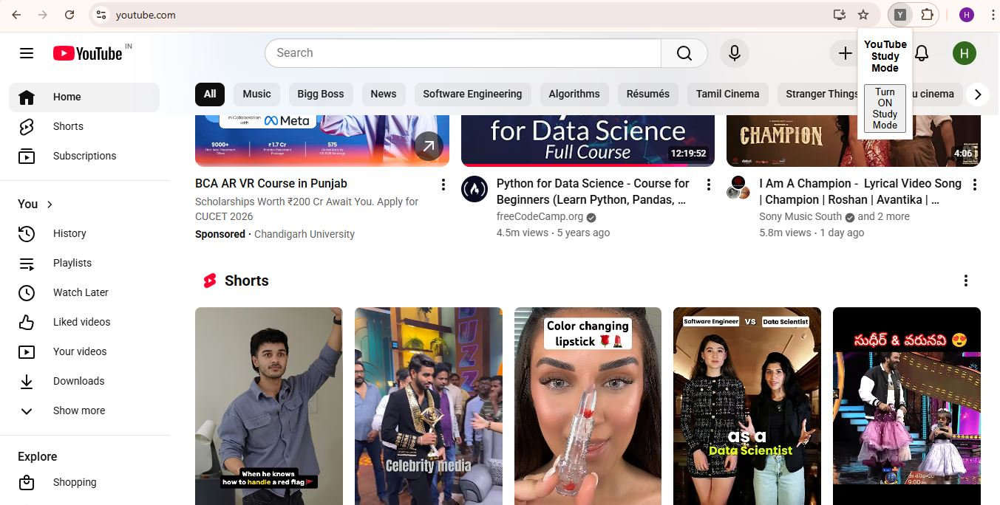
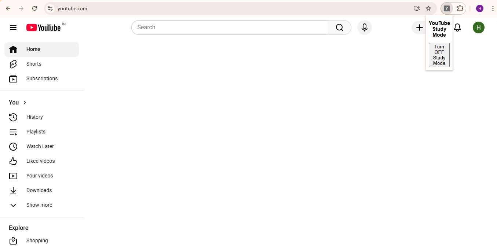

**🎓 Study Mode Chrome Extension**

**Stay focused on YouTube! 🚀**  
This Chrome Extension puts YouTube into **Study Mode** by removing distracting elements like recommendations and sidebars, and lets you **toggle ON/OFF** with a single button. Perfect for boosting focus and productivity. 💡  

**✨ Features:**  
- 🔘 Toggle Study Mode ON/OFF easily  
- ❌ Removes distracting YouTube elements  
- 💾 Saves your preferences using Chrome Storage API  
- 🎨 Lightweight and interactive UI  

**💻 Tech Stack:**  
- JavaScript (DOM manipulation & event listeners)  
- HTML & CSS  
- Chrome Extension APIs  

**⚡ How to Use:**  
1. Clone or download this repo  screenshorts/Capture4.JPG
2. Open Chrome → Extensions → Enable **Developer Mode**  
3. Click **“Load unpacked”** and select this project folder  
4. Open YouTube → Toggle Study Mode ON/OFF from the extension icon  

## 📸 Screenshots
### 1️⃣ Extension Icon / Popup
  

### 2️⃣ YouTube Before Study Mode
  

### 3️⃣ YouTube After Study Mode

**📌 Status:**  
✅ Fully functional locally  
🔜 Can be extended for Chrome Web Store deployment  

